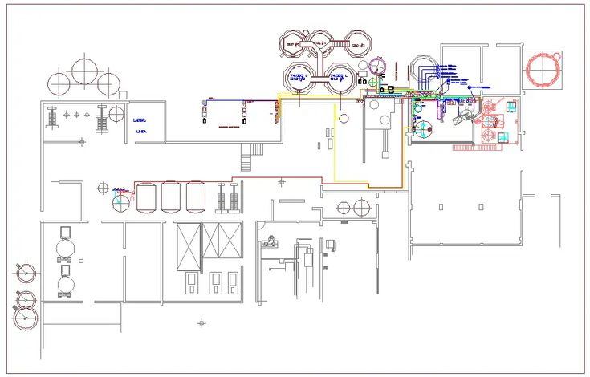
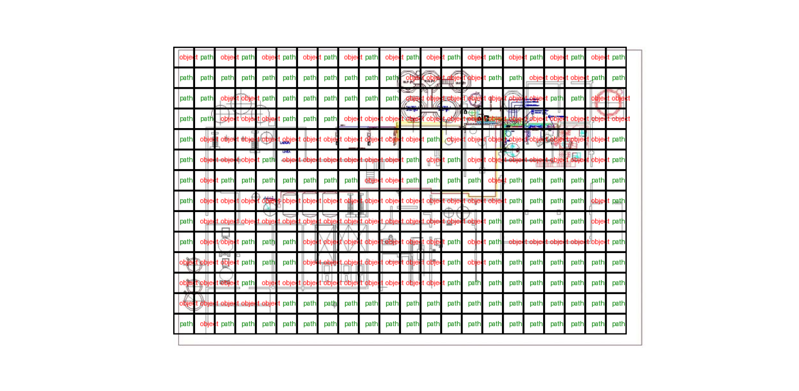
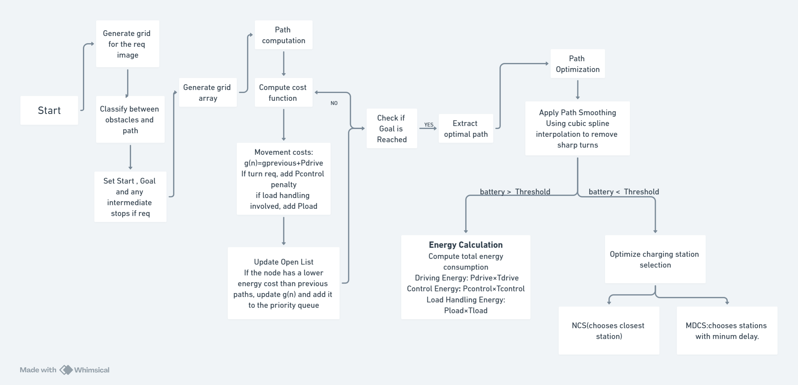
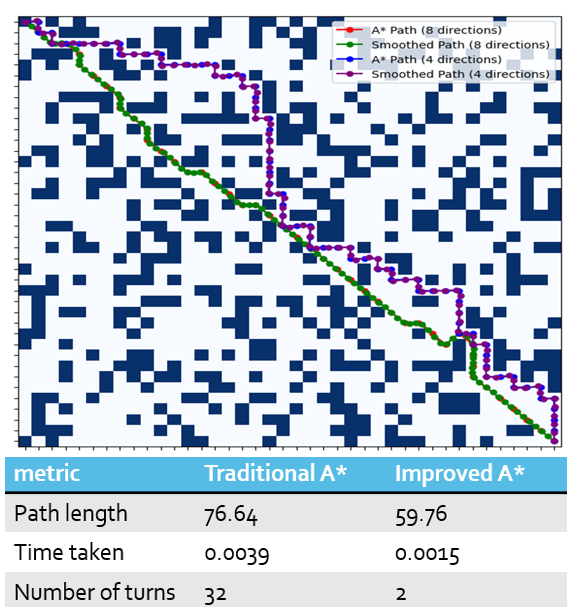
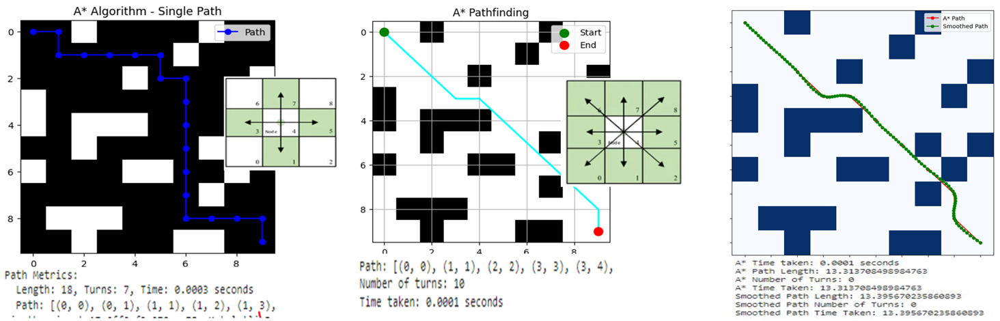
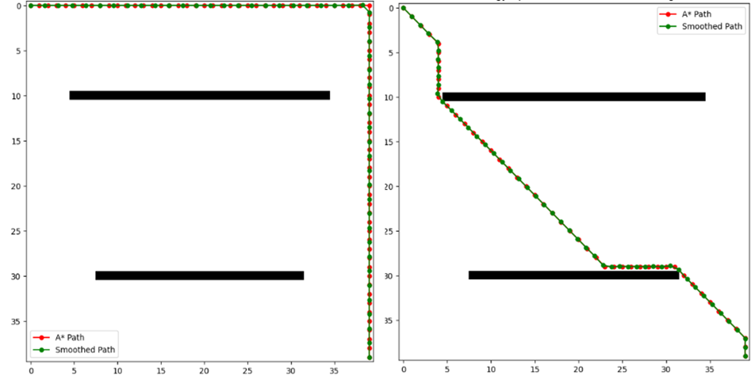
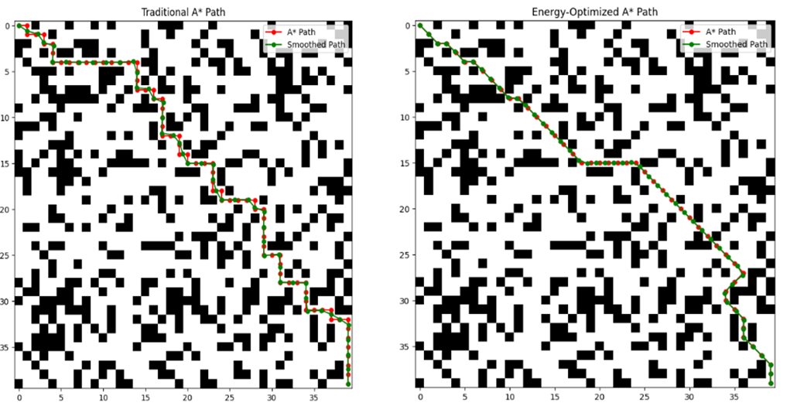

# Energy Optimized AGV Path Planning and Fleet Management
The work provides a ROS 2 simulation for Automated Guided Vehicles (AGVs) that prioritizes energy efficiency over simple distance minimization. By integrating a state-based Energy Requirement Model (ERM) into the A* algorithm, this system achieves up to 39.74% energy savings compared to traditional pathfinding methods.

---

## 1. Project Overview

With AGVs typically consuming approximately **0.22 kWh/ton-km** per day, reducing energy consumption is critical for both environmental sustainability and lowering operational costs. 

This project implements a multi-objective optimization problem to minimize the cost function:

$$minX = w_1D + w_2E$$

Where:
*   $D$ = Total distance
*   $E$ = Total energy consumption
*   $w_1, w_2$ = Weighting constants

---

## 2. Key Features

*   **Energy-Aware A* Search:** Replaces traditional distance-based weights with real-world energy consumption values for movements, turns, and idling.
*   **State-Based Modeling:** Accounts for **10 distinct AGV states**, including acceleration, constant drive, deceleration, and load handling.
*   **Dual-Stage Charging Strategy:** Implements **NCS** (Nearest Charging Station) and **MDCS** (Minimum Delay Charging Station) strategies with variable State of Charge (SoC) targets (90%, 95%, 100%).
*   **Path Optimization:** Utilizes **Cubic Spline interpolation** to smooth paths and eliminate energy-intensive sharp turns.
*   **Intelligent Dispatching:** A centralized node that dynamically assigns tasks based on AGV battery levels and task urgency.

---

## 3. Project Structure
```plaintext
agv_energy_planner/
├── agv_energy_planner/
│   ├── __init__.py
│   ├── energy_path_planner.py  # Core A* and ERM logic
│   ├── agv_node.py             # Individual AGV controller
│   └── dispatcher_node.py      # Task assignment and fleet management
├── launch/
│   └── agv_system_launch.py    # Launches full fleet simulation
├── docs/
│   └── theoretical_model.md    # Detailed ERM and charging math
├── assets/
│   ├── images
│   ├── papers
│   └── results
├── package.xml                 # ROS 2 package dependencies
└── setup.py                    # ROS 2 entry points and build configuration
```

## 4. System Workflow

*   **Grid Generation:** The system generates a high-resolution grid and classifies obstacles and traversable paths.


*   **Task Dispatching:** The `dispatcher_node` receives tasks and selects the best AGV based on a score derived from distance and urgency.
*   **Path Computation:** The selected AGV calculates an optimal path using the **Energy-Based Cost Function**:

$$f(n) = \sum_{i=1}^{k} (E_{\text{drive},i} + E_{\text{control},i} + E_{\text{load},i}) + d(n, \text{goal}) \times E_{\text{unit}}$$

where $E_{\text{unit}}$ is the average energy per unit distance.

*   **Battery Management:** If the battery level drops below a **23% trigger level**, the AGV initiates a charging procedure to its nearest or least-delayed station.
*   **Smoothing & Execution:** The path is simplified via shortcutting and cubic splines before execution to reduce motor strain.


## 5. Implementation Data
The model is calibrated using experimental mean power values obtained from the research paper: *"[Energy Requirement Modeling for Automated Guided Vehicles Considering Material Flow and Layout Data](https://www.mdpi.com/2411-9660/8/3/48)"*.

| Parameter | Value |
| :--- | :--- |
| **Active Control Power** | 63.19 W |
| **Standard Drive Power** | 55.15 W |
| **Active Load Handling** | 54.71 W |
| **Standby/Idle Power** | 7.50 W |

## 6. Results
Below is a demonstration of the AGV performing task dispatching and energy-efficient path smoothing:




<p align="center">
  <video src="assets/results/output.mp4" width="800" controls></video>
</p>

---

## 7. Installation & Setup

### Prerequisites
*   **ROS 2:** Humble or newer
*   **Python:** 3.10+
*   **Dependencies:** `numpy`, `scipy`, `matplotlib`

### Installation

1. **Create a workspace:**
   ```bash
   mkdir -p ~/agv_ws/src
   cd ~/agv_ws/src
   ```
2. **Clone the repository:**
    ```bash
    git clone [https://github.com/yourusername/agv_energy_planner.git]  (https://github.com/yourusername/agv_energy_planner.git)
    ```
3. **Install dependencies and build:**
```bash
    cd ~/agv_ws
rosdep install -i --from-path src --rosdistro humble -y
colcon build --packages-select agv_energy_planner
```
Run the System
```bash
source install/setup.bash
ros2 launch agv_energy_planner agv_system_launch.py
```
## Reference
1. Base Framework: [MOIRO-KAIROS/moiro_agv](https://github.com/MOIRO-KAIROS/moiro_agv)
2. Data Source: Sperling, M., & Furmans, K. (2024). Energy Requirement Modeling for Automated Guided Vehicles Considering Material Flow and Layout Data. Logistics, 8(3), 48. https://doi.org/10.3390/logistics8030048
